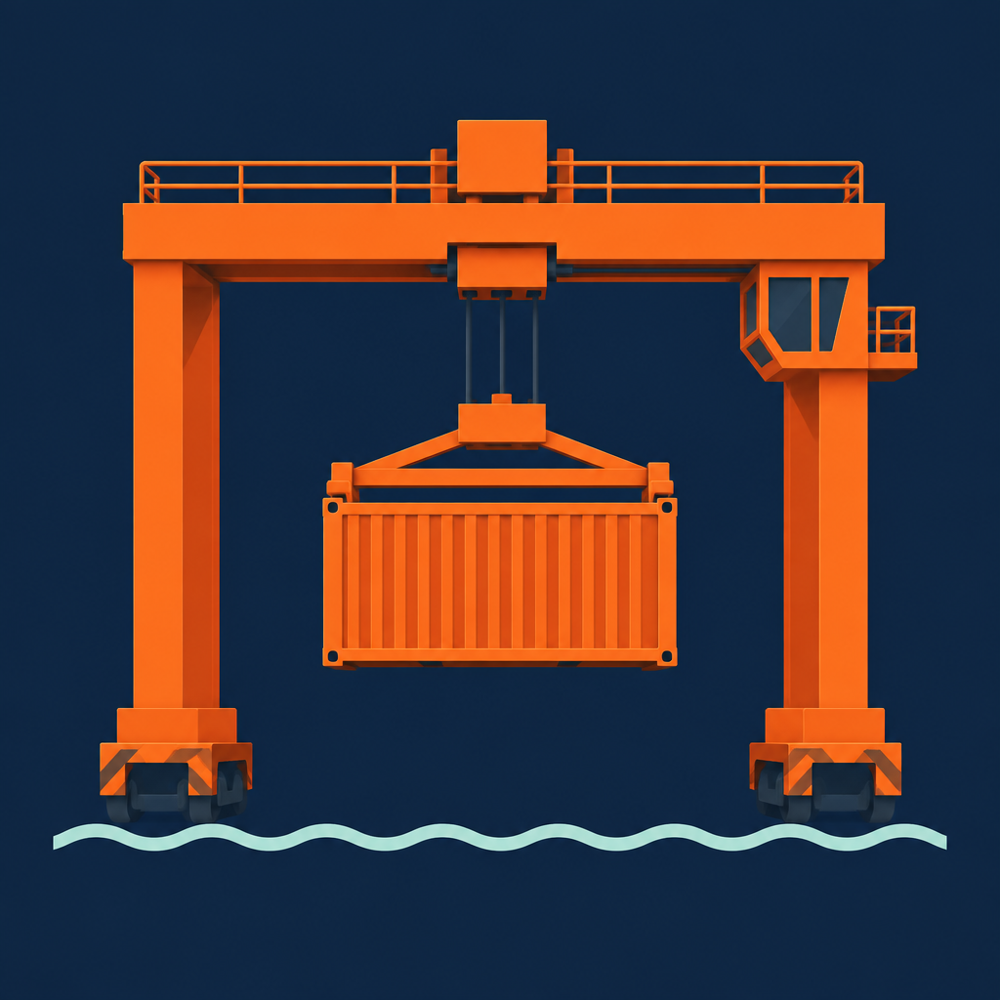
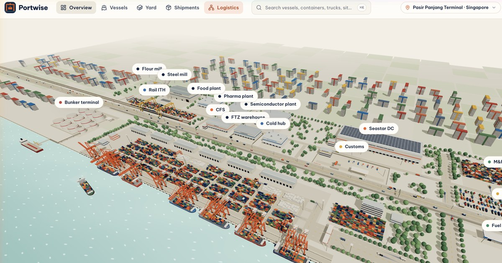

<div align="center">



# Portwise

**A live, isometric 3D operations map of a container terminal, for the shipping line's view of the port.**

Watch vessels arrive, quay cranes work, yard blocks fill up, trucks clear the gates and shipments make their way inland, all moving in real time in your browser.

[**Live demo**](https://seaport-logistics-3d.rork.app) · [Features](#features) · [Getting started](#getting-started) · [Architecture](#architecture) · [Contributing](#contributing)

<br />



</div>

---

## Table of contents

- [Overview](#overview)
- [Features](#features)
- [Screens](#screens)
- [Keyboard shortcuts](#keyboard-shortcuts)
- [Tech stack](#tech-stack)
- [Getting started](#getting-started)
- [Available scripts](#available-scripts)
- [Project structure](#project-structure)
- [Architecture](#architecture)
  - [One sim clock for everything](#one-sim-clock-for-everything)
  - [AIS-driven ship motion](#ais-driven-ship-motion)
  - [Rendering the port](#rendering-the-port)
  - [Boot sequence](#boot-sequence)
  - [State management](#state-management)
- [Customising the simulation](#customising-the-simulation)
- [Design system](#design-system)
- [Performance notes](#performance-notes)
- [Browser support](#browser-support)
- [Deployment](#deployment)
- [Roadmap](#roadmap)
- [Contributing](#contributing)
- [Disclaimer](#disclaimer)
- [License](#license)
- [Acknowledgements](#acknowledgements)

---

## Overview

Portwise is a desktop-first web app that turns a container terminal into a living control room. It follows **Seastar Lines**, a fictional carrier, through **Pasir Panjang Terminal, Port of Singapore**. The terminal faces south onto the Singapore Strait. The clock runs on SGT (UTC+8) and the AIS positions use real coordinates around 1.2735° N, 103.7695° E.

The whole viewport is a low-poly three.js scene that never stops moving:

- **8 berths** with **7 vessels alongside** and **14 ship-to-shore (STS) quay cranes**
- A **40-block container yard** (A1–D10) with thousands of colour-coded boxes
- A **gate plaza**, an empty depot and **19 gate trucks** plus **8 drayage trucks**
- **Strait traffic** in a Traffic Separation Scheme, the **Western Anchorage**, pilots and tugs
- A full **logistics district** behind the terminal with an expressway, a rail terminal, warehouses, cold chain, customs X-ray, factories, a bunker terminal, HDB estates and a downtown skyline

The UI floats over the scene as crisp paper panels. The look is "morning nautical chart": cream chart paper, ink-navy type, signal-orange accents and pale seafoam water.

> **Everything is simulated client-side.** There is no backend, no API key and no real AIS feed. Clone it, run it, and the port comes alive.

---

## Features

### 🚢 Live 3D terminal
- Quay cranes run full discharge and load cycles: trolley out, spreader down, lift, swing, set down. Discharge counts tick up live.
- Vessels berth, work cargo and sail. Tugs push from the seaward side and cast off.
- Trucks loop through the gates and yard lanes, each leaving a fading **comet trail** so you can read its direction at a glance.
- Click any vessel, crane, yard block, container, truck or facility. The camera flies to it and a detail card opens.

### 📡 AIS-realistic ship movement
- Ships never follow canned paths. They move **only** from simulated **AIS Class A position reports** (ITU-R M.1371 messages 1/2/3), each one encoded to and decoded from real **NMEA 0183 `!AIVDM`** sentences.
- Reporting intervals follow the standard: 10 s under way, 3⅓ s while turning, 3 min when moored or anchored. Reports include GNSS noise, ~3–8% missed slots and receive latency.
- Between fixes the hull is **dead-reckoned** from SOG, COG and ROT, then eased onto each new fix over 2.2 s.
- A 3D overlay shows a dashed past track, diamond fixes and a 1-minute COG/SOG vector.
- The **AIS tab** shows nav status, link health (Receiving / Signal stale / Target lost), SOG·COG·HDG·ROT, DMS position, MMSI, call sign, draught, destination, reception % and a raw sentence feed.

### ⚓ Real port-call choreography
Each voyage is a continuous chain of legs: *sea passage → anchorage → pilotage → tug-assisted berthing → alongside → unberthing → outbound*. Every nav-status change is a forced AIS report.

This morning's scenario:
- **ORIENT LOTUS** comes in from the Strait, anchors at the Western Anchorage, picks up an MPA pilot and berths at B3 (09:50).
- **MERLION STAR** finishes cargo, STS-01 raises its boom, and she unberths from B1 at 09:51 and joins the eastbound lane.
- **BLUE MARLIN** anchors to wait for her 13:30 berth window.
- Eight regional feeders and coasters transit the TSS, keeping to starboard between IALA-A lane buoys.

### ⏱️ Time machine
- A global **time bar** with play/pause, rewind and fast-forward (×2 / ×8 / ×32), ±30 s jumps and a scrubber over the **last hour**.
- Severity-coloured **event markers** on the scrubber jump to the moment and fly the camera to the target.
- Every animation, KPI, alert and log line is a **pure function of sim time**, so replay matches what happened exactly, down to each crane's trolley position.

### 🏭 Logistics district
- **AYE expressway** viaduct with left-hand traffic and Singapore-green overhead signs.
- **Tuas ITH Rail Terminal** with a 16-flatcar shuttle on a 12-minute cycle, two RMG cranes and level-crossing barriers.
- CFS, an FTZ warehouse, a cold chain hub, an **ICA inspection centre with a drive-through X-ray portal**, a truck staging lot and a service station.
- A distribution centre with rooftop solar, an M&R depot, semiconductor, pharma, food and steel plants, flour mill silos and a **bunker terminal** with a tanker at the jetty.
- Drayage trucks shuttle between the terminal and the district. Every site has a live status line and an info card.
- **Live warehouse storage**: tap a storage site (CFS, FTZ warehouse, cold hub, Seastar DC, M&R depot, flour silos, bunker tanks) to see its cargo types and current capacity. You get stock vs. capacity with a fill %, a bay-by-bay capacity map (or tank and silo level gauges), the cargo mix, zone and chamber fill with live cold-room temperatures, and a live log of what is coming in and going out. Everything replays with the time bar.

### 🌦️ Real-time sky & weather
- The sun follows its real path over Pasir Panjang on the Singapore clock. You get dawn, golden hour, dusk and a moonlit night. At dusk, crane floods, red aviation beacons, sodium yard masts, ship navigation lights, truck lights, buoy blinkers and lit windows come on.
- Weather is live from [Open-Meteo](https://open-meteo.com) (with air quality) and refreshes every 10 minutes. There are six looks:
  - **Clear** and **Cloudy**.
  - **Rain**: wind-slanted streaks and raindrop rings on the water.
  - **Storm**: lightning, a choppy grey sea, and ships pitching and rolling.
  - **Fog** and **Haze**.
- It affects operations:
  - Gusts of 20 m/s or more, or lightning, put the quay cranes on a weather hold (booms raised).
  - Rain and fog cut crane productivity.
  - A live weather alert tops the alerts list.
- **Demo panel** (weather button on the camera rail): a 24 h sky slider, a 72 s day time-lapse, weather presets and a "Back to live" button. Keys: N toggles day/night, W cycles the weather.
- The HUD stays on light paper, so the UI is always readable.

### 🧭 Operator HUD
- **Arrivals & departures board**: a live list of every berthing (ETB/ATB) and sailing (ETD/ATD) today. It shows planned vs. estimated times, delay minutes and reasons, cargo or approach progress, a countdown to the next movement and an on-time %. Weather holds push estimates back. It is on both Overview and Vessels.
- **KPIs**: TEU today, crane productivity, on-time berthing, yard utilisation.
- **Alerts**: late vessels, gate congestion, wind stops. Click one to fly the camera to it.
- **24 h berth plan** Gantt chart with a moving now-line.
- **⌘K command palette** to search vessels, containers, trucks, shipments, blocks, cranes and logistics sites.
- **Hide panels** mode for a clean view of the whole map.
- **Ship-type filter** (camera rail, shortcut T): show all ships, or only container ships, tankers or bulk carriers. Hidden ships sink away and the ones you pick pop back up. Each hull type has its own 3D model, and tankers and bulk carriers sail the Strait or lie at anchor.
- A polished **boot screen** that preloads fonts, the 3D engine, the scene, the shaders and the first frames, so the port is fully warm when it appears.

---

## Screens

| Route | Screen | What you get |
| --- | --- | --- |
| `/` | **Overview** | Full-bleed port, KPI stack, alerts, 24 h berth plan |
| `/vessels` | **Vessels** | Vessels grouped Under way / At berth / At anchor / Expected / Sailed, plus the Arrivals & departures board and a VTS "Port movements" panel |
| `/vessels/:id` | **Vessel detail** | Overview, Containers, Activity (live crane-move log) and AIS tabs; wind widget; berth-focused Gantt |
| `/yard`, `/yard/:blockId?c=:containerId` | **Yard** | Block list with Import / Export / Reefer filters and occupancy bars; container card with "View journey" |
| `/shipments/:id` | **Shipment** | 6-step journey timeline, a 3D route for the shipment's truck and live gate traffic |
| `/logistics`, `/logistics/:id` | **Logistics** | District sites grouped by type, inland flow shares, rail shuttle and customs status, facility cards |

Clicking a crane or a truck opens its inspector on any screen. Closing it brings back that screen's own panel.

---

## Keyboard shortcuts

| Key | Action |
| --- | --- |
| <kbd>⌘</kbd> / <kbd>Ctrl</kbd> + <kbd>K</kbd> | Open search |
| <kbd>Space</kbd> | Play / pause the sim |
| <kbd>←</kbd> / <kbd>→</kbd> | Step back / forward 10 s |
| <kbd>Shift</kbd> + <kbd>←</kbd> / <kbd>→</kbd> | Step back / forward 60 s |
| <kbd>L</kbd> | Jump back to live |
| <kbd>N</kbd> | Toggle night view |
| <kbd>H</kbd> | Hide / show panels |

Mouse: drag to orbit, right-drag to pan, scroll to zoom. The camera rail in the bottom-right has zoom, rotate and home buttons.

---

## Tech stack

| Area | Choice |
| --- | --- |
| Language | TypeScript (strict) |
| UI | React 19, React Router 6 |
| Build | Vite 8 |
| 3D | three.js via React Three Fiber 9 and drei 10 (`CameraControls`, `Html`, `Text`, `AdaptiveDpr`) |
| Styling | Tailwind CSS 3, shadcn/ui (Radix primitives), `tailwindcss-animate` |
| Icons | lucide-react |
| Search | cmdk |
| Data fetching | TanStack Query (wired in for a future live feed) |
| Tests | Vitest (node and Playwright browser mode) |
| Lint | ESLint 9 + typescript-eslint |
| Package manager | Bun |
| Fonts | Be Vietnam Pro (UI), JetBrains Mono (IDs, numbers, times) |

---

## Getting started

### Prerequisites

- **[Bun](https://bun.sh) 1.1+** (recommended). npm or pnpm also work with the standard `package.json` scripts.
- **Node.js 20.19+ or 22.12+**, which Vite 8 requires.
- A desktop browser with **WebGL 2** and hardware acceleration turned on.

### Install and run

```bash
git clone https://github.com/<your-username>/portwise.git
cd portwise/web-portwise

bun install
bun run dev
```

Then open **http://localhost:8080**.

### Production build

```bash
bun run build      # outputs to web-portwise/dist
bun run preview    # serves the production build locally
```

No environment variables are needed. The app is fully static.

---

## Available scripts

Run these from `web-portwise/`:

| Script | Description |
| --- | --- |
| `bun run dev` | Start the Vite dev server on port 8080 with HMR |
| `bun run build` | Production build to `dist/` |
| `bun run build:dev` | Build in development mode (unminified, easier to debug) |
| `bun run preview` | Serve the built `dist/` locally |
| `bun run lint` | Run ESLint over the project |
| `bun run test` | Run unit tests, then browser tests |
| `bun run test:watch` | Unit tests in watch mode |
| `bun run test:browser` | Browser tests (Vitest + Playwright Chromium) in watch mode |

Type check only:

```bash
bun x tsc -p tsconfig.app.json --noEmit
```

---

## Project structure

```text
.
├── README.md
├── LICENSE
└── web-portwise/
    ├── index.html                 # Entry HTML, meta and Open Graph tags, Google Fonts
    ├── public/
    │   ├── fonts/                 # Be Vietnam Pro Bold for 3D SDF text (troika)
    │   ├── icon.png, favicon.png
    │   └── og-image.jpg           # Social share card
    └── src/
        ├── App.tsx                # Providers + routes
        ├── main.tsx
        ├── index.css              # Design tokens, utility classes, keyframes
        ├── components/
        │   ├── BootScreen.tsx     # Preloading cover with the crane-stacking animation
        │   ├── hud/               # Floating panels: TopBar, TimeBar, KPIs, Alerts,
        │   │                      #   BerthSchedule, AIS panel, Port movements,
        │   │                      #   Crane/Truck cards, CameraRail, SearchDialog…
        │   └── ui/                # shadcn/ui primitives
        ├── data/                  # Static scenario: vessels, cranes, trucks, containers,
        │                          #   facilities, drayage runs, layout constants, types
        ├── pages/                 # Route screens (Overview, Vessels, Yard, Shipment, Logistics…)
        ├── sim/
        │   ├── simStore.ts        # The sim clock, replay controls, derived live state
        │   ├── constants.ts       # Start time, replay window, formatters
        │   ├── logistics.ts       # Rail shuttle, customs scanner, facility live status
        │   ├── storage.ts         # Live warehouse stock, zones and movements
        │   └── ais/
        │       ├── nmea.ts        # AIVDM encode/decode, checksums, Class A intervals
        │       ├── voyage.ts      # Leg-based ground-truth ship motion
        │       ├── portCalls.ts   # This morning's scripted port calls
        │       ├── tracks.ts      # Pre-generated report streams per vessel
        │       ├── tracker.ts     # Dead reckoning, blending, staleness, reception stats
        │       ├── static.ts      # AIS message 5 static & voyage data
        │       └── geo.ts         # WGS-84 ↔ scene projection, bearings, DMS formatting
        ├── state/
        │   ├── PortProvider.tsx   # Selection, routing and camera focus
        │   ├── boot.ts            # Boot stage store
        │   ├── environment.ts     # Sky clock (live / manual / time-lapse), live + demo weather, port impact
        │   ├── nightMode.ts       # Eased night-light blend
        │   ├── hudVisibility.ts   # Hide panels toggle
        │   └── shipFilter.ts      # Ship-type map filter (all / container / tanker / bulk)
        └── three/
            ├── PortScene.tsx      # <Canvas> and world
            ├── Atmosphere.tsx     # Sun path, sky/fog ramps, weather blend, rain, lightning
            ├── CameraRig.tsx      # CameraControls + fly-to shots
            ├── SceneReady.tsx     # Shader precompile + warm frames for boot
            ├── Water.tsx, Terrain.tsx
            ├── Vessel.tsx         # Berthed ships, port calls, strait traffic
            ├── QuayCrane.tsx, Yard.tsx, Trucks.tsx
            ├── AisOverlay.tsx     # Tracks, fixes, COG/SOG vectors
            ├── Chip3D.tsx         # Floating HTML labels pinned to 3D points
            ├── nightLights.tsx    # Glow sprites and light pools
            ├── parts.tsx          # Shared low-poly parts
            └── district/          # Roads & expressway, rail ICD, facilities, movers, kit
```

---

## Architecture

### One sim clock for everything

`src/sim/simStore.ts` owns a single **simulation clock**. Sim time `t` is in seconds relative to **09:44:00 SGT**. The clock can be live, paused, or playing at any rate from −32× to +32×, and it is clamped to a one-hour replay window (`MIN_T = -3600`).

Everything that moves or counts is a **pure function of `t`**:

```ts
const t = simT();                           // read once per frame
const status = craneStatusAt(crane, t);     // working / waiting / wind stop
const fix = aisFix(vesselId, t, scratch);   // ship pose from AIS reports received by t
const train = trainAt(t);                   // rail shuttle phase and slot contents
```

No component keeps its own timers or accumulates per-frame deltas. That is why scrubbing backwards, pausing mid-lift or fast-forwarding at ×32 always shows exactly the state the port was in at that moment. When you add new motion, **derive it from `t`; never integrate it.**

React subscribes through `useSyncExternalStore` with throttled notifications. 3D components read the clock directly inside `useFrame` and write to refs and instanced buffers, so the React tree does not re-render 60 times a second.

### AIS-driven ship motion

```text
voyage.ts (ground truth legs)
      │  sample at ITU-R M.1371 intervals, add GNSS noise, drop ~3–8% of slots
      ▼
nmea.ts  encodePositionReport() ──► "!AIVDM,1,1,,A,15M…,0*5C"
      │  receive latency
      ▼
nmea.ts  decodeAivdm() ──► PositionReport (quantised like the wire format)
      │
      ▼
tracker.ts aisFix(id, t)  → last received report + dead reckoning (SOG/COG/ROT arc)
                          → 2.2 s blend onto each new fix
                          → stale / lost flags (6 min for Class A)
                          → snap to berth when moored
      │
      ▼
Vessel.tsx / AisOverlay.tsx / AisPanel.tsx
```

Report field names follow the **AISStream.io JSON schema**, so a real feed could replace the simulated one later without touching the tracker or the UI.

Scene geometry: north is −z, east is +x, and **1 scene unit = 3 m**. `geo.ts` projects between WGS-84 and scene units on a local tangent plane.

### Rendering the port

- **Instancing everywhere.** Yard containers, trees, buildings, cars and lights are `InstancedMesh`es. Per-frame updates write matrices or colours in place.
- **Floating labels** (`Chip3D`) use drei's `<Html>` and stay below the HUD in z-order. 3D signage uses troika SDF `<Text>` with a bundled font.
- **Sky & weather**: one rig computes the real solar position and eases the weather layers (`weatherFx`: cloud, rain, storm, fog, haze, wind, crane hold). It also drives `nightFx.mix`, which sets the sky, fog, lights, water colour and night glow sprites. Rain is a single GPU line-segment buffer animated in the vertex shader from sim time. Lightning strikes are a seeded function of sim time, so replay stays exact.
- **Selection** uses an orange emissive tint on parts plus a world-space outline on hulls and containers. Hover uses a lighter tint.
- **Adaptive resolution** with drei's `<AdaptiveDpr>` keeps the frame rate up on weaker GPUs.

### Boot sequence

`BootScreen` stays up until all five stages in `src/state/boot.ts` are done:

| Stage | Done when |
| --- | --- |
| `fonts` | Every UI font weight loads (`document.fonts.load`, capped at 4.5 s) |
| `engine` | The lazy `PortScene` chunk resolves and the `<Canvas>` is created |
| `scene` | The scene's `<Suspense>` boundary resolves (models, SDF fonts, district) |
| `shaders` | `renderer.compileAsync(scene, camera)` finishes |
| `frames` | 12 warm frames render (shadow maps, text atlases, instance buffers) |

Then the cover fades out, the HUD mounts and the camera fly-in starts. A 30 s safety timeout makes sure the app always opens.

### State management

| Store | Kind | Purpose |
| --- | --- | --- |
| `simStore` | Module store + `useSyncExternalStore` | Clock, replay controls, derived live numbers, alerts, events |
| `PortProvider` | React context (`@nkzw/create-context-hook`) | Current selection, camera focus, route sync |
| `environment` | Module store + React Query (Open-Meteo) | Sky clock, live/demo weather, port impact |
| `hudVisibility` | Module store | Hide panels |
| `shipFilter` | Module store | Ship types shown on the 3D map |
| `boot` | Module store | Boot progress and reveal |

Module-level stores let both the HUD and the 3D scene read shared state without prop drilling or extra renders.

---

## Customising the simulation

All scenario data lives in plain TypeScript under `src/data/` and `src/sim/`:

| What to change | Where |
| --- | --- |
| Port name, carrier, vessels, cranes, trucks, alerts | `src/data/port.ts` |
| Yard containers and shipments | `src/data/containers.ts` |
| Logistics facilities | `src/data/facilities.ts` |
| Drayage runs | `src/data/drayage.ts` |
| Colours and layout constants | `src/data/layout.ts` |
| Start time, time zone, replay window | `src/sim/constants.ts` |
| Port calls (arrivals, departures, anchorage) | `src/sim/ais/portCalls.ts` |
| AIS static data (MMSI, call sign, size, draught) | `src/sim/ais/static.ts` |
| Map origin (lat/lon) and scale | `src/sim/ais/geo.ts` |
| Rail shuttle and customs cycles | `src/sim/logistics.ts` |
| Warehouse cargo, capacity and zones | `src/data/storage.ts` |

Tips:
- Keep new motion **deterministic in `t`**. If something needs randomness, seed it from an ID, never from `Math.random()` per frame.
- A port call is a list of legs, each ending at an absolute sim time. Make legs continuous in position and speed, and the tracker and UI will pick them up automatically.
- To move the terminal somewhere else, update `GEO_ORIGIN`, `UTC_OFFSET_SEC`, names in `port.ts` and the traffic side in the district roads.

---

## Design system

| Token | Value | Use |
| --- | --- | --- |
| Cream canvas | `#F3EFE6` | Land, page background |
| Paper | `#FFFDF8` | Panels |
| Hairline | `#E3DDD0` | Borders |
| Sand | `#EDE8DC` | Fills, tracks |
| Ink | `#12233F` | Text, primary actions |
| Signal | `#F2622E` | Selection, cranes, live, current step |
| Moss | `#2F8F6B` | Success, live state |
| Amber | `#E8A317` | Warnings |
| Brick | `#C8423B` | Danger, stops |
| Harbor | `#2C6FB0` | Info, AIS tracks |
| Water | `#BFDCD6` → `#9CC8C2` | Shallow → deep |

- **Type:** Be Vietnam Pro (400–800) for all UI text. JetBrains Mono (500–700, tabular figures) for vessel IDs, container numbers, plates, times and KPIs.
- **Panels:** 14 px radius, 1 px hairline border, soft ink shadow. Status chips are tinted pills with a 6 px dot.
- **Rules:** no purple, no glassmorphism, no dark-mode UI. The 3D night view is the only dark surface.

---

## Performance notes

- Portwise is built for **desktop GPUs**. Integrated graphics from the last few years run it smoothly. Software rendering (no GPU, some VMs and CI runners) works but is slow.
- If the frame rate drops, use **Hide panels** (H) and avoid zooming fully out at night, which is when the most glow sprites are on screen.
- Make sure your browser has hardware acceleration turned on (Chrome: *Settings → System → Use graphics acceleration when available*).
- The 3D engine and scene load in a separate lazy chunk, so the first paint (the boot screen) is fast.

---

## Browser support

| Browser | Status |
| --- | --- |
| Chrome / Edge 113+ | ✅ Recommended |
| Firefox 115+ | ✅ Supported |
| Safari 17+ (macOS) | ✅ Supported |
| Mobile browsers | ⚠️ Renders, but the layout is designed for screens ≥ 1280 px wide |

---

## Deployment

The build output in `web-portwise/dist` is a static single-page app, so any static host works: Vercel, Netlify, Cloudflare Pages, GitHub Pages, S3 + CloudFront, and so on.

Because routes like `/vessels/:id` are handled on the client, set up an **SPA fallback** so unknown paths serve `index.html`:

**Netlify** (`web-portwise/public/_redirects`)
```text
/*  /index.html  200
```

**Vercel** (`web-portwise/vercel.json`)
```json
{ "rewrites": [{ "source": "/(.*)", "destination": "/index.html" }] }
```

**Cloudflare Pages** handles SPA fallback automatically when there is no `404.html`.

If you deploy to your own domain, update the absolute `og:url`, `og:image` and `twitter:image` URLs in `web-portwise/index.html`.

---

## Roadmap

Ideas the project is open to:

- [ ] Plug in a live AIS feed (e.g. AISStream.io WebSocket) behind the existing tracker
- [ ] Multi-terminal switching (Tuas, Jurong)
- [ ] Level-of-detail labels that hide trucks and blocks when zoomed out
- [ ] Unit tests for the NMEA encoder/decoder and the dead-reckoning tracker
- [ ] Shareable deep links to a moment in time (`?t=…`)
- [ ] Localisation of the HUD
- [ ] Responsive tablet layout

---

## Contributing

Contributions are very welcome, from bug reports and design polish to new simulation features.

1. **Fork** the repo and create a branch: `git checkout -b feat/my-change`.
2. Install and run: `cd web-portwise && bun install && bun run dev`.
3. Make your change. Please keep to these rules:
   - TypeScript strict, no `any`, explicit types on state.
   - **All motion is a pure function of sim time** so replay stays exact.
   - Reuse the existing design tokens. Don't add new colours or fonts without discussion.
   - Prefer instancing and refs in `useFrame` over React state for anything per-frame.
4. Check your work:
   ```bash
   bun run lint
   bun x tsc -p tsconfig.app.json --noEmit
   bun run test
   bun run build
   ```
5. Open a **pull request** with a short description and, for visual changes, a screenshot or a short clip.

For larger changes, please open an issue first so we can agree on the approach.

---

## Disclaimer

Portwise is a **demo and visualisation project**. All vessels, companies, people, containers, trucks, schedules, MMSIs and figures are **fictional** and generated client-side. The terminal layout is stylised and not to survey accuracy. Portwise is **not affiliated with, endorsed by or connected to** PSA International, the Maritime and Port Authority of Singapore (MPA), Immigration & Checkpoints Authority (ICA) or any shipping line. It must not be used for navigation or real operational decisions.

---

## License

Released under the [MIT License](LICENSE).

---

## Acknowledgements

- [three.js](https://threejs.org), [React Three Fiber](https://r3f.docs.pmnd.rs) and [drei](https://drei.docs.pmnd.rs) by the pmndrs collective
- [troika-three-text](https://protectwise.github.io/troika/troika-three-text/) for crisp SDF text in 3D
- [shadcn/ui](https://ui.shadcn.com), [Radix UI](https://www.radix-ui.com), [Tailwind CSS](https://tailwindcss.com) and [lucide](https://lucide.dev)
- [Be Vietnam Pro](https://fonts.google.com/specimen/Be+Vietnam+Pro) and [JetBrains Mono](https://www.jetbrains.com/lp/mono/) fonts
- ITU-R M.1371 and NMEA 0183 for the AIS message formats, and [AISStream.io](https://aisstream.io) for the JSON schema conventions
- Built with [Rork](https://rork.com)

<div align="center">
<br />
<sub>Made with ⚓ for everyone who likes watching cranes.</sub>
</div>
